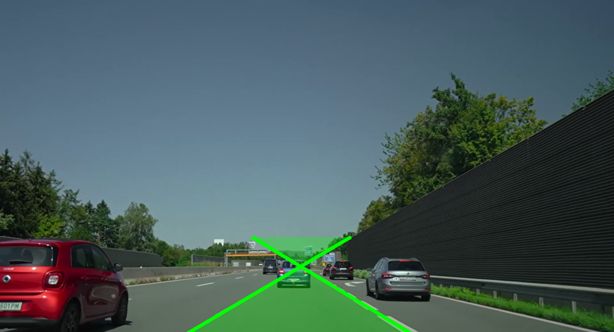
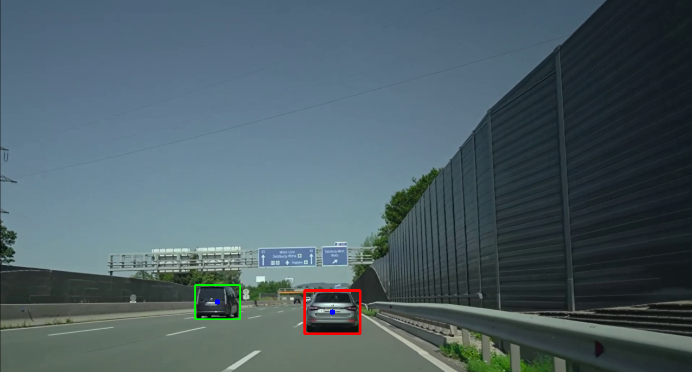
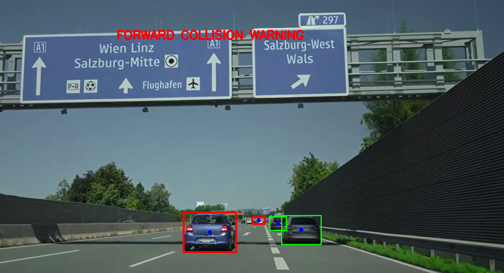

# Forward Collision Warning (FCW) System

## Overview

This project is a basic Forward Collision Warning (FCW) prototype built using OpenCV and YOLOv8.

The system detects lane boundaries, identifies vehicles on the road, determines whether a vehicle is inside the current driving lane, and generates a collision warning when a vehicle ahead appears too close.

The goal of this project is to demonstrate the core perception pipeline used in Advanced Driver Assistance Systems (ADAS).

---

## Features

* Lane detection using OpenCV
* Region of Interest (ROI) based road extraction
* Lane line estimation using Hough Transform
* Lane area visualization
* Vehicle detection using YOLOv8
* Vehicle-in-lane filtering
* Distance estimation using bounding box size
* Forward Collision Warning generation

---

## Project Structure

```text
Forward-Collision-Warning/
│
├── main.py
├── lane_detector.py
├── vehicle_detector.py
├── collision_logic.py
├── screenshots/
│   ├── lane_detection.png
│   ├── vehicle_detection.png
│   └── collision_warning.png
└── README.md
```

### main.py

Controls the complete FCW pipeline.

Responsibilities:

* Read video frames
* Call lane detection
* Call vehicle detection
* Run collision logic
* Display final output

### lane_detector.py

Handles lane detection.

Responsibilities:

* Edge detection
* Road masking
* Hough line detection
* Lane averaging
* Lane polygon generation

### vehicle_detector.py

Handles vehicle detection using YOLOv8.

Detected classes:

* Car
* Motorcycle
* Bus
* Truck

### collision_logic.py

Handles FCW decision making.

Responsibilities:

* Check whether a vehicle is inside the lane
* Estimate proximity using bounding box height
* Trigger collision warning

---

## Technologies Used

* Python
* OpenCV
* NumPy
* YOLOv8 (Ultralytics)

---

## Running the Project

1. Clone the repository
2. Install the required libraries
3. Place the input video in the project folder
4. Run:

```bash
python main.py
```

---

## Demo Screenshots

### Lane Detection



### Vehicle Detection and Lane Filtering



### Forward Collision Warning



---

## How It Works

### Step 1: Lane Detection

The road area is isolated using a Region of Interest (ROI).

Lane segments are detected using the Probabilistic Hough Transform and combined into left and right lane boundaries.

### Step 2: Vehicle Detection

YOLOv8 detects vehicles in each frame.

Bounding boxes are generated for:

* Cars
* Motorcycles
* Buses
* Trucks

### Step 3: Vehicle-in-Lane Check

The center point of each vehicle is tested against the lane polygon.

Vehicles inside the lane are treated as target vehicles.

### Step 4: Collision Warning

The height of the vehicle bounding box is used as a simple proximity estimate, where larger bounding boxes indicate vehicles that are closer to the camera.

If the estimated distance exceeds a predefined threshold, a Forward Collision Warning is displayed.

---

## Output

The system provides:

* Lane visualization
* Vehicle bounding boxes
* Vehicle center points
* Forward Collision Warning alerts

---

## Future Improvements

* Real-world distance estimation
* Time-To-Collision (TTC) calculation
* Lane departure warning
* Object tracking across frames
* Real-time webcam support
* Raspberry Pi deployment
* Radar/LiDAR integration

---

## Author

Venkat Goud

Computer Vision Project – Forward Collision Warning System
